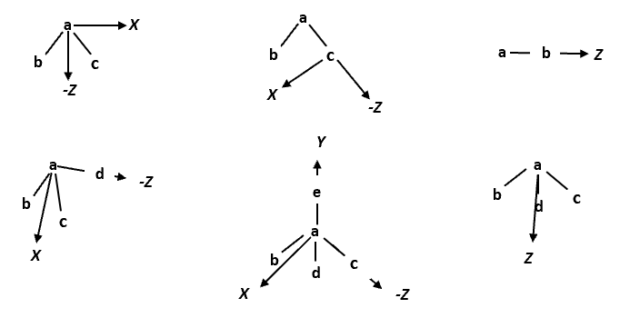

## Multipoles




* Top left: bisector
* Top middle: z-then-x
* Top right z-only
* Bottom left: bisector-then-x
* Bottom middle: z-then-x-then-y
* Bottom right: trisector

* examples of these coordinate systems can be found in README_MANIFEST, see SymmetryExamples

### Multipole Parameters
```
M1 M2 M3      q
              Dx  Dy  Dz
              Qxx
              Qxy  Qyy
              Qxz  Qyz  Qzz
```

### Z-then-X
* M1 M2 M3 

### bisector
* M1 M2 -M2, or M1 -M2 M2, or M1 -M2 -M2

### bisector-then-X
* M1 M2 -M3 -M3

* typically Dy, Qxy, Qyz components are zero, unless it is chiral such as C_alpha in protein


## A Special example of Nitrate

Note NO3- is fairly flat and rigid so we are able to use Z-then-X for both N and O. For N, all dipole components have to be 0 and the Qxx and Qzz are equal (x and Z are in the plane, y is normal to the plane). For O, the "2 1 2" also works because the direction of "X" or "Y" is not affecting the (sign) of Qxx or Qyy.
```
--------AMOEBA Parameters for Nitrate Ion-----


atom 1 1 N "Nitrate N" 7 14.007 3

atom 2 2 O "Nitrate O" 8 15.999 1

vdw 1 3.7100 0.1100

vdw 2 3.5100 0.1120

bond 1 2 390.0 1.2606

angle 2 1 2 155.00 120.00

strbnd 2 1 2 18.70 18.70

opbend 2 1 2 2 172.00

multipole 1 2 2 1.07363

                  0.00000 0.00000 0.00000
                  
                  0.14407
                  
                  0.00000 -0.28814
                  
                  0.00000 0.00000 0.14407

multipole 2 1 2 -0.69121

                 0.00000 0.00000 0.04941
                 
                -0.50067
                
                 0.00000 -0.08271
                 
                 0.00000 0.00000 0.58338

polarize 1 1.0730 0.3900 2

polarize 2 0.8370 0.3900 1
```
